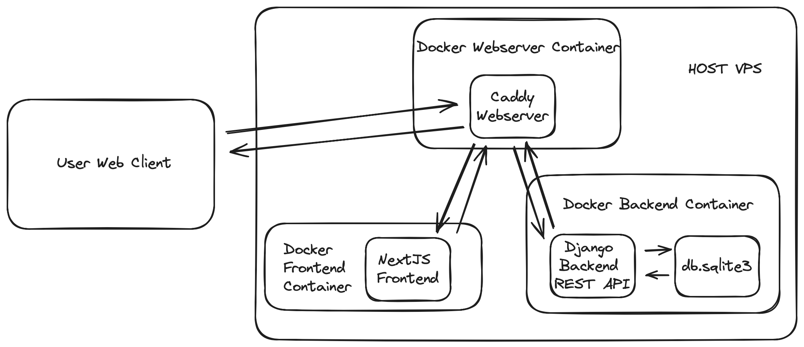

# Project Intention
This project serves as a hub to show clients/employers my projects, resume and other code related work.

# Technology Used to Develop this Project
- Frontend uses Next.js
- Backend uses Django for content management and database management
- Database uses Django's default db.sqlite3

# System Design Overview



## Components:
### Django Backend:
Responsible for handling server-side logic, data processing, and communication with the database.
Utilizes Django ORM for database operations and Django REST Framework for building RESTful APIs.
Serves as the core backend logic for the application, handling user authentication for admin, data storage, and business logic.
### Next.js Frontend:
Responsible for client-side rendering, user interface components, and interaction with users.
Utilizes React.js framework, ShadCN UI for building dynamic and interactive UI components.
Integrates with the Django backend via RESTful API endpoints to fetch and manipulate data.
### SQLite Database (db.sqlite3):
Lightweight SQL database used for storing application data.
Utilized by the Django backend to persist data models and application state.
Provides relational database capabilities for efficient data storage and retrieval.
### Caddy Web Server:
Acts as the HTTP server and reverse proxy for serving the Django backend and Next.js frontend.
Handles requests, manages SSL/TLS encryption, and provides static file serving capabilities.
Enables efficient routing of requests to the appropriate backend or frontend components.
## Interactions:
The Next.js frontend communicates with the Django backend via RESTful API endpoints to retrieve and manipulate data.
The Django backend interacts with the SQLite database to perform CRUD (Create, Read, Update, Delete) operations on application data.
Caddy web server proxies requests to the Django backend for API calls and to the Next.js frontend for serving static assets and client-side rendering.
## Deployment:
The entire system is deployed using Docker for containerizing each component.
Docker Compose can be used to orchestrate the deployment of multiple containers, including Django, Next.js, SQLite, and Caddy.
The deployment process should include steps for building Docker images, configuring environment variables, and setting up networking and volumes.
Once deployed, the system can be accessed through the configured domain or IP address, with HTTPS encryption provided by Caddy.

### Test Deployment
#### git clone repo
```shell
git clone https://github.com/NoCapCbas/portfolio.git
```

#### Update .env file for live deployment
Navigate to inside of the repo.
Update the .env file within the main project directory:
```shell
## python settings
PYTHONUNBUFFERED=1
PYTHONDONTWRITEBYTECODE=1
## django env variables
SECRET_KEY='django-insecure-123'
DEBUG=True
LIVE=False

## django Super-User Credentials
SUPER_USER_NAME='root'
SUPER_USER_PASSWORD='root'
SUPER_USER_EMAIL='root@root.com'
```
#### Update Caddyfile
Caddyfile should look like the following:
```shell
# Main configuration for HTTPS
localhost {
  log

  reverse_proxy /api/* http://portfolio_backend:8000

  reverse_proxy /* http://portfolio_frontend:3001
}

```

#### Run Docker
Run the following docker command:
```shell
docker compose -f docker-compose.test.yml up --build -d
```

#### Django Admin
Log in with root user.

### Live Deployment
#### git clone repo
```shell
git clone https://github.com/NoCapCbas/portfolio.git
```

#### Update .env file for live deployment
Navigate to inside of the repo.
Update the .env file within the main project directory:
```shell
## python settings
PYTHONUNBUFFERED=1
PYTHONDONTWRITEBYTECODE=1
## django env variables
SECRET_KEY='django-insecure-123'
DEBUG=False
LIVE=True

## django Super-User Credentials
SUPER_USER_NAME='root'
SUPER_USER_PASSWORD='root'
SUPER_USER_EMAIL='root@root.com'
```
Change SECRET_KEY 

#### Update Caddyfile
Caddyfile should look like the following:
```shell
# Main configuration for HTTPS
damondiaz.xyz {
  log

  reverse_proxy /api/* http://portfolio_backend:8000

  reverse_proxy /* http://portfolio_frontend:3001
}

```

#### Run Docker
Run the following docker command:
```shell
docker compose -f docker-compose.prod.yml up --build -d
```

#### Django Admin
Log in with root user, then create new custom user and delete root user.


